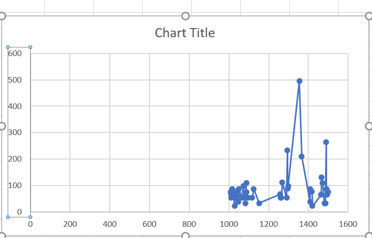
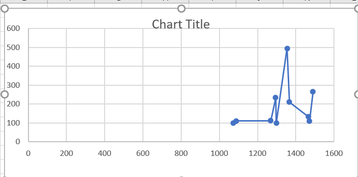

# Telluri-map-reduce-Candidate_Marks
Basic map reduce using python on Student marks dataset
## Data
For this map reduce, data of the student marks in different courses.

This data is taken from the website Dta-World and the link is as follows:  
[Data Link](https://data.world/asadrizvi/online-admission-data)

Data is collected from online admission data of students and their marks and CGPA of students.

## Question to be answered from this map reduce
Find out the average marks of one of the course Physics based on online application number

## Summary of the results
* The following scattered graph shows the marks in physics of all applications

    By seeing the graph , we can predict the following results:
    - In the graph we can see that one of the candidate got highest marks 500 among other students.
    - second highest scorer close to 300 points.
    - remaining candidates got same average points.
    
*   The following  graph shows the top 10 average marks in physics by application numbers.

 From the above agraph we can see that top physics marks obtaind students with different application numbers.